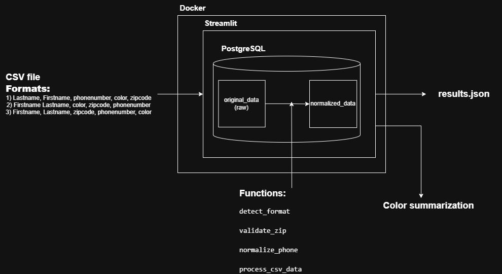

# Streaver - CSV to JSON Normalizer

Aplicación Streamlit que procesa archivos CSV, normaliza los datos y los almacena en PostgreSQL, generando archivos JSON formateados.

## Características

- 📊 Interfaz web con Streamlit
- 🔄 Normalización de números telefónicos a formato xxx-xxx-xxxx
- 🗄️ Almacenamiento en PostgreSQL con dos tablas (original y normalizada)
- 📝 Exportación a JSON con formato indentado (2 espacios) y claves ordenadas
- ✅ Validación de datos y reporte de errores por línea
- 📈 Ordenamiento alfabético por apellido y nombre
- 📊 Conteo de color más popular entre los registros de los csvs.



## Estructura del Proyecto

```
Streaver/
├── app/
│   ├── main.py              
│   ├── assets/
│   │   └── image.png        
│   └── utils/
│       ├── database.py      
│       └── normalizer.py    
├── Dockerfile               
├── docker-compose.yml      
├── requirements.txt
│── diagram.png         
├── .env                     
└── README.md                
```

## Requisitos

- Python 3.11+
- PostgreSQL 15+
- Docker y Docker Compose (opcional)

## Instalación

### Opción 1: Con Docker (Recomendado)

1. Clonar el repositorio
2. Copiar el archivo de configuración:
```powershell
Copy-Item .env.example .env
```

3. Iniciar los servicios:
```powershell
docker-compose up -d
```

4. Acceder a la aplicación en: http://localhost:8501

## Uso

1. Abrir la aplicación en el navegador
2. Cargar un archivo CSV con las columnas
3. Hacer clic en "Process and Normalize Data"
4. Revisar los resultados normalizados
5. Descargar el archivo `result.json` generado

### Ejemplo de JSON de Salida

```json
{
  "entries": [
    {
      "firstname": "John",
      "lastname": "Doe",
      "phonenumber": "123-456-7890",
      "zipcode": "12345",
      "color": "red"
    },
    {
      "firstname": "Jane",
      "lastname": "Smith",
      "phonenumber": "555-123-4567",
      "zipcode": "54321",
      "color": "blue"
    }
  ],
  "errors": []
}
```

## Reglas de Normalización

1. **Números telefónicos**: Se convierten al formato `xxx-xxx-xxxx`
2. **Códigos postales**: Se validan formatos de 5 dígitos
3. **Ordenamiento**: Las entradas se ordenan alfabéticamente por `(lastname, firstname)`
4. **Errores**: Las líneas con errores se registran en la lista `errors` con su número de línea
5. **JSON**: Salida con indentación de 2 espacios y claves ordenadas ascendentemente

## Tablas de Base de Datos

### original_data
- `id`: Serial Primary Key
- `upload_timestamp`: Timestamp
- `raw_data`: JSONB (datos originales del CSV)

### normalized_data
- `id`: Serial Primary Key
- `upload_timestamp`: Timestamp
- `firstname`: VARCHAR(255)
- `lastname`: VARCHAR(255)
- `phonenumber`: VARCHAR(20)
- `zipcode`: VARCHAR(10)
- `color`: VARCHAR(50)
- `original_id`: Foreign Key a original_data

## Tecnologías

- **Streamlit**: Framework de interfaz web
- **PostgreSQL**: Base de datos relacional
- **Pandas**: Procesamiento de datos
- **psycopg2**: Conector PostgreSQL
- **Docker**: Contenerización
